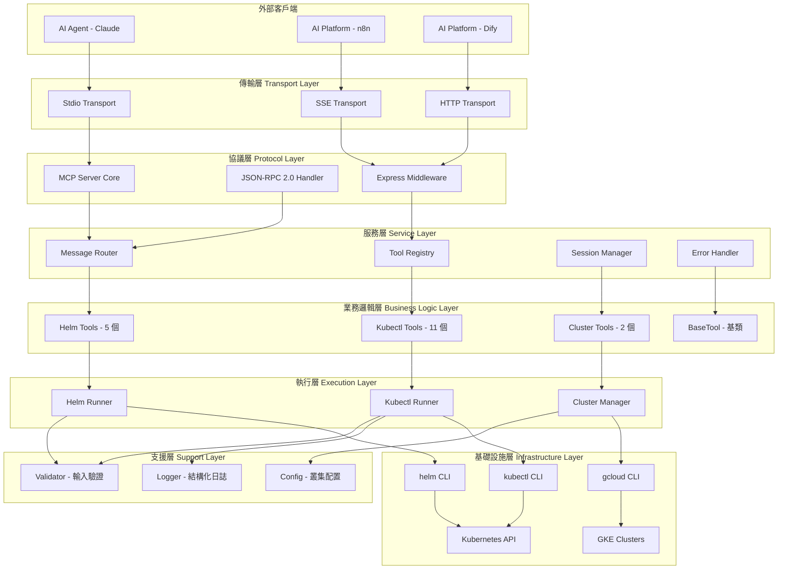
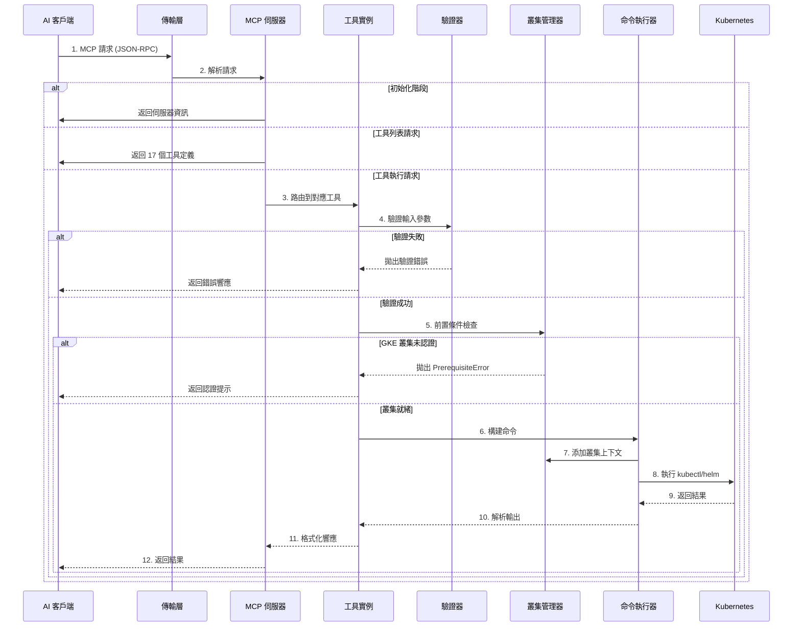
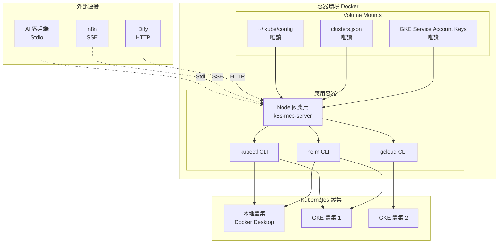

# K8s MCP Server - 系統架構文檔

> 版本：1.0.0
> 更新日期：2025-12-17
> 文檔類型：SDD/DDD (Specification/Domain Driven Design)

---

## 1. 系統概覽

### 1.1 架構風格

**Modular Monolith（模組化單體架構）**

此專案採用模組化單體架構，適合中小型專案。雖然是單一部署單元，但內部高度模組化，各模組職責清晰、耦合度低。

**選擇依據**：
- 團隊規模較小，不需要微服務的複雜性
- 部署簡單，維護成本低
- 通過模組化設計保持代碼可維護性
- 支援多種傳輸模式（Stdio、SSE、HTTP）增加彈性

### 1.2 主要模組

```
k8s-mcp-server/
├── 入口層 (Entry Layer)
│   └── index.js - 應用程式啟動、參數解析、生命週期管理
│
├── 伺服器層 (Server Layer)
│   └── server.js - MCP 協議處理、HTTP/SSE 伺服器、請求路由
│
├── 工具層 (Tools Layer)
│   ├── base-tool.js - 工具基類、統一介面定義
│   ├── kubectl-*.js (11 個) - Kubernetes 操作工具
│   ├── helm-*.js (5 個) - Helm 管理工具
│   └── cluster-*.js (2 個) - 叢集管理工具
│
└── 工具層 (Utils Layer)
    ├── logger.js - 結構化日誌
    ├── validator.js - 輸入驗證與安全防護
    ├── kubectl.js - kubectl 命令執行器
    ├── helm.js - helm 命令執行器
    └── cluster-manager.js - 多叢集配置與認證
```

---

## 2. 分層架構圖



---

## 3. 資料流圖



---

## 4. 部署架構



---

## 5. 模組詳細說明

### 5.1 入口層 (Entry Layer)

**檔案**: `src/index.js`

**職責**:
- 應用程式生命週期管理
- 命令列參數解析 (`--http`, `--port`)
- 環境變數設定 (`NODE_ENV`, `LOG_LEVEL`)
- 優雅關閉處理 (SIGTERM/SIGINT)
- 全域錯誤捕獲 (uncaughtException, unhandledRejection)

### 5.2 伺服器層 (Server Layer)

**檔案**: `src/server.js`

**職責**:
- MCP 協議實作 (2024-11-05 版本)
- JSON-RPC 2.0 訊息處理
- 多傳輸模式支援 (Stdio/SSE/HTTP)
- 工具註冊與路由
- SSE 連接管理

**核心函數**:
```javascript
setupMCPServer()         // 初始化 MCP 伺服器與工具
createMCPHandler()       // MCP 訊息處理器
createExpressApp()       // Express + SSE 應用
createMCPServer(config)  // 統一入口
```

**HTTP 端點**:
| 端點 | 方法 | 說明 |
|------|------|------|
| `/health` | GET | 健康檢查 |
| `/sse` | GET | SSE 連接建立 (n8n) |
| `/messages` | POST | MCP 訊息接收 (SSE 模式) |
| `/mcp` | POST/GET | 直接 MCP 調用 (Dify) |
| `/tools` | GET | 工具列表查詢 |
| `/info` | GET | 伺服器資訊 |
| `/sse-status` | GET | SSE 連接狀態 |

### 5.3 工具層 (Tools Layer)

#### 5.3.1 工具基類 (BaseTool)

**檔案**: `src/tools/base-tool.js`

**設計模式**: Template Method Pattern

**提供功能**:
- 前置條件檢查 (`validatePrerequisites`)
- 統一響應格式 (`createSuccessResponse`, `createErrorResponse`)
- 結構化日誌 (`logSuccess`, `logError`)
- 自定義錯誤類型 (`PrerequisiteError`)

**類別結構**:
```javascript
class BaseTool {
  constructor(name, description)
  getDefinition()           // 抽象方法
  execute(args)             // 抽象方法
  validatePrerequisites()   // 前置條件檢查
  createSuccessResponse()   // 成功響應
  createErrorResponse()     // 錯誤響應
}
```

#### 5.3.2 工具分類

**Kubectl 工具 (11 個)**:
| 工具 | 檔案 | 功能 |
|------|------|------|
| kubectl_get | kubectl-get.js | 資源查詢 |
| kubectl_logs | kubectl-logs.js | Pod 日誌 |
| kubectl_describe | kubectl-describe.js | 資源描述 |
| kubectl_cluster_info | kubectl-cluster-info.js | 叢集資訊 |
| kubectl_get_yaml | kubectl-get-yaml.js | YAML 匯出 |
| kubectl_top_nodes | kubectl-top-nodes.js | 節點監控 |
| kubectl_top_pods | kubectl-top-pods.js | Pod 監控 |
| kubectl_top_containers | kubectl-top-containers.js | 容器監控 |
| kubectl_scale_deployment | kubectl-scale-deployment.js | 擴縮容 |
| kubectl_restart_deployment | kubectl-restart-deployment.js | 重啟 |
| kubectl_edit_hpa | kubectl-edit-hpa.js | HPA 編輯 |

**Helm 工具 (5 個)**:
| 工具 | 檔案 | 功能 |
|------|------|------|
| helm_list | helm-list.js | Release 列表 |
| helm_status | helm-status.js | Release 狀態 |
| helm_repo_list | helm-repo-list.js | 倉庫列表 |
| helm_get_values | helm-get-values.js | 配置值 |
| helm_history | helm-history.js | 歷史記錄 |

**叢集管理工具 (2 個)**:
| 工具 | 檔案 | 功能 |
|------|------|------|
| cluster_list | cluster-list.js | 叢集列表 |
| gke_auth | gke-auth.js | GKE 認證 |

### 5.4 工具函式層 (Utils Layer)

#### 5.4.1 日誌模組 (Logger)

**檔案**: `src/utils/logger.js`

**功能**:
- 結構化 JSON 日誌輸出
- 日誌等級過濾 (debug/info/warn/error)
- Error 物件序列化
- ISO 時間戳

#### 5.4.2 驗證模組 (Validator)

**檔案**: `src/utils/validator.js`

**安全功能**:
- 危險字元檢測
- 輸入長度限制 (1000 字元)
- Kubernetes 命名規則驗證
- 標籤格式驗證
- 叢集 ID 格式檢查

#### 5.4.3 命令執行器

**檔案**: `src/utils/kubectl.js`, `src/utils/helm.js`

**功能**:
- 命令構建與參數組裝
- 叢集上下文自動添加
- 超時控制 (kubectl: 30s, helm: 60s)
- 標準輸出/錯誤處理
- 優雅的進程終止

#### 5.4.4 叢集管理器

**檔案**: `src/utils/cluster-manager.js`

**職責**:
- 叢集配置載入與驗證
- GKE 認證流程管理
- 叢集切換與上下文管理
- 前置條件檢查
- 認證狀態緩存

**GKE 認證流程**:
```
1. gcloud auth activate-service-account
2. gcloud container clusters get-credentials
3. kubectl config use-context
4. kubectl cluster-info (驗證)
5. 設定緩存 + 等待穩定
```

---

## 6. 第三方整合

### 6.1 系統依賴

| 依賴 | 版本 | 用途 |
|------|------|------|
| kubectl | >= 1.20 | Kubernetes 命令列工具 |
| helm | >= 3.0 | Kubernetes 套件管理器 |
| gcloud CLI | 最新 | Google Cloud SDK |
| gke-gcloud-auth-plugin | 最新 | GKE 認證外掛 |

### 6.2 Node.js 依賴

```json
{
  "@modelcontextprotocol/sdk": "^1.13.0",
  "express": "^4.18.2",
  "zod": "^3.22.4",
  "node-fetch": "^3.3.2"
}
```

### 6.3 MCP 協議方法

| 方法 | 用途 |
|------|------|
| initialize | 初始化握手 |
| notifications/initialized | 初始化完成通知 |
| tools/list | 工具列表查詢 |
| tools/call | 工具執行請求 |
| resources/list | 資源列表 (空實作) |
| prompts/list | 提示模板列表 (空實作) |
| ping | 伺服器心跳 |

---

## 7. 架構優勢與限制

### 7.1 優勢

| 面向 | 說明 |
|------|------|
| 模組化設計 | 清晰分層，職責分明 |
| 安全性 | 多層驗證，命令注入防護 |
| 可維護性 | 結構化日誌，統一錯誤處理 |
| 擴展性 | 多傳輸模式，工具易於新增 |

### 7.2 限制

| 面向 | 說明 |
|------|------|
| 性能 | CLI 執行比直接 API 慢 |
| 擴展性 | 單體架構，無法水平擴展 |
| 功能 | 不支援 apply/patch 等複雜操作 |
| 依賴 | 強依賴外部 CLI 工具 |

---

## 8. 檔案索引

| 檔案 | 路徑 | 用途 |
|------|------|------|
| 主程式 | `src/index.js` | 應用入口 |
| 伺服器 | `src/server.js` | MCP + Express |
| 工具基類 | `src/tools/base-tool.js` | 工具基類 |
| 執行器 | `src/utils/kubectl.js` | kubectl 執行 |
| 執行器 | `src/utils/helm.js` | helm 執行 |
| 叢集管理 | `src/utils/cluster-manager.js` | 多叢集管理 |
| 驗證器 | `src/utils/validator.js` | 輸入驗證 |
| 日誌器 | `src/utils/logger.js` | 結構化日誌 |
| 配置 | `src/config/clusters.json` | 叢集定義 |
